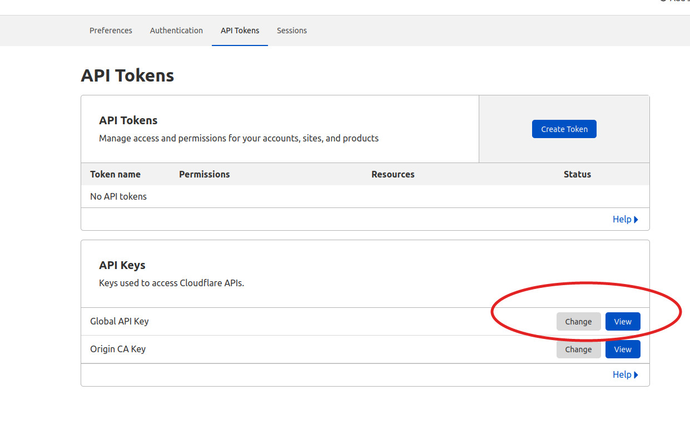
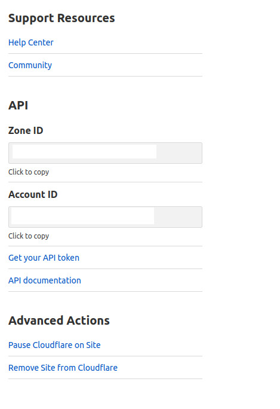

### ABLE A/B TESTING FOR CLOUDFLARE APPLICATIONS WITH UMAMI ANALYTICS DASHBOARD

Who is this for?

Someone who is hosting a JAMStack application on Cloudflare and wants to run a split test. We offer the option to use your own analytics service like Google Analytics, or we
can deploy an Umami Webserver to AWS infrastructure for you which will use ECS and RDS under your custom domain name with the url `ableumami.yoursite.whatever`, and
in about 30-40 minutes you will have a fully operational split test with a beautiful and informative dashboard for your own custom events!

#### PREREQUISITES

- IF USING UMAMI DASHBOARD:
  - AWS account and credentials configured on local machine
  - `aws-cdk` installed globally
- `npm` installed
- Have handy your

  - Cloudflare `EMAIL`
  - Cloudflare `GLOBAL API_KEY` - Found under `Profile->API Tokens`

  

  - Cloudflare `ACCOUNT_ID` - Click on your application and these are found on the lower right sidebar
  - Cloudflare `ZONE_ID` for the site you will be testing against

  

  - Have your Cloudflare Pages set to **deploy all branches** to preview branches (the default)

#### TO USE

1. `npm i -g @abletest/able` (may have to use `sudo`)

2. IF USING UMAMI DASHBOARD:

   - Run `cdk bootsrap aws://${AWS_ACCOUNT_NUMBER}/'us-east-1'` (this must use us-east-1 region)

3. `able setup` - Setup of Umami server infrastructure (if selected) takes approximately 20-25 minutes.

4. `able config` - This will generate a file called `ableConfig.json` that you will fill in with your split test configurations.
   If you are using the Umami Dashboard, log in using `admin` and `umami` and set up your destinations there under `settings->add website` and copy the script tags into the
   appropriate variants in the `ableConfig.json` file. Be careful to nest your single quotes inside your double quotes and not vice-versa ;)

5. Create and push your test branches to github and Cloudflare where they will be deployed to preview branches. Enter these URLS, which are going to match the branch name
   along with the Cloudflare pages site name; ie, `test.mysite.pages.dev`, into the `ableConfig.json` file.

6. `able deploy` to deploy the split test to Cloudflare. This will take approximately 5-10 seconds.

#### TO UPDATE

1. Make changes to the `ableConfig.json` file

2. `able update` to push those changes to Cloudflare. They will be live in a few seconds.

#### TO TEARDOWN

1. `able destroy-test` to remove split test from Cloudflare.

2. `able destroy-umami` to teardown Umami server. This process takes approximately 25-30 minutes.

#### TO RUN NEW TESTS

1. Push new code with tests to your repo & Cloudflare pages site

2. Edit your Umami dashboard with new control and variant names and copy the scipt tags

3. Update the `variants` section of the `ableConfig.json` file with the new control and test variant paths and scripts

4. Run the `able update` command
